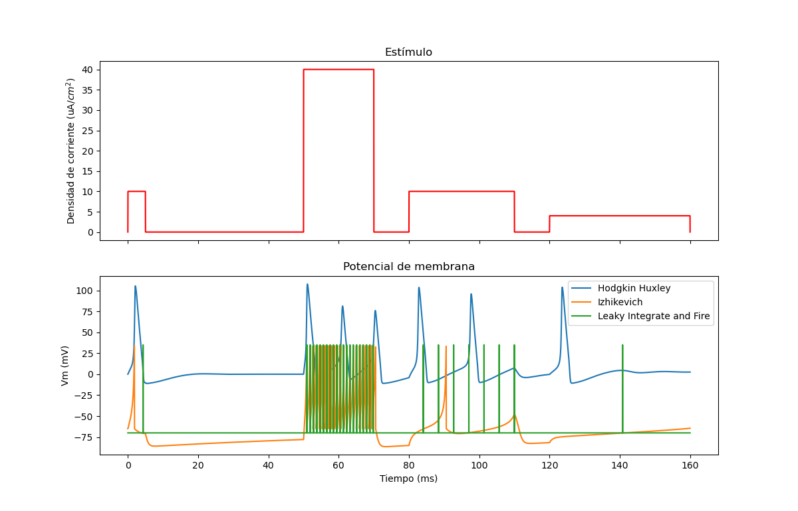

# Different biological neuron models 

## Conductance-based models
- Hodgkin-Huxley model
- FitzHugh–Nagumo model

## Threshold models
- [Izhikevich model](https://www.izhikevich.org/publications/spikes.htm)
- Leaky Integrate-and-fire

## Model plot

